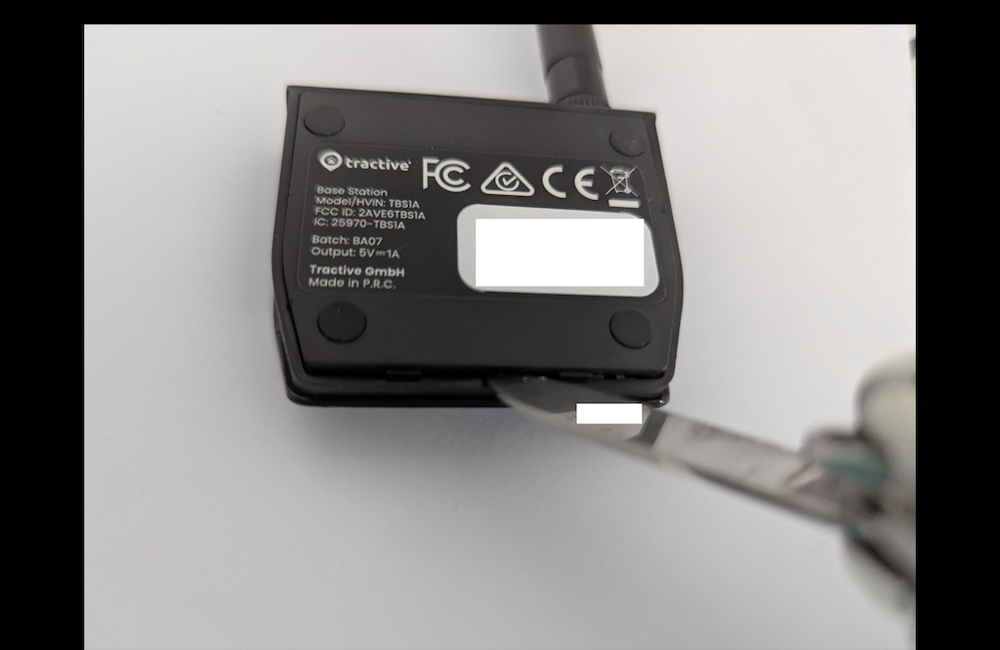
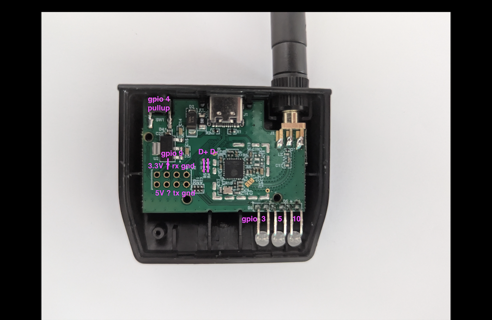

# Base_Station_Light V1.1
🧐 Reverse Engineering 🐾 ESP32-C3 Base Station 🛜 TheSunIsShiningTheWeatherIsSweet ☼

[Target](https://www.ecosia.org/search?q=base+station+kostenlos): ESP32-C3 FH4

Provides a dummy wifi access point for another device, that will go into powersave mode 🤷.

My goals:
1. figure out the WPA2 password from the running firmware
2. 3 LED GPIOs + switch GPIO
3. the 2 ? on the 8 pin header
4. get ota working, so no device opening needed

Steps taken so far:

- ✅ for now to get first contact: [Enable USB-Serial/JTAG](01_USB_JTAG.md)
- [read flash](02_flash_dump.md)
- decompile
- ..

